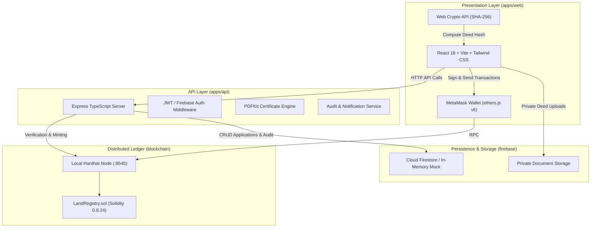
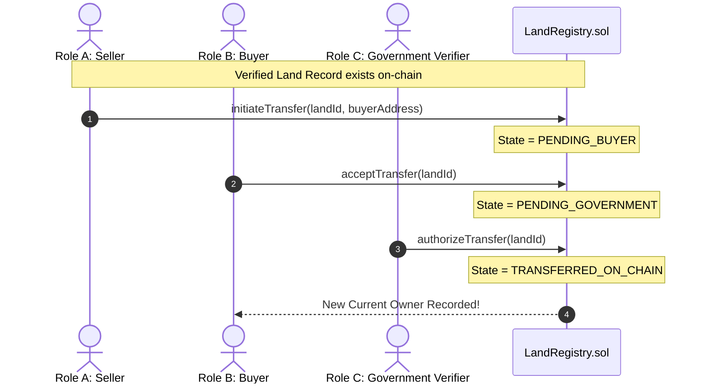

# LANDCHAIN — Blockchain-Based Land Registry Management System

> **Tagline:** *Secure Land Records. Transparent Ownership.*  
> **Type:** Full-Stack Academic Prototype & Technical Demonstration  
> **Architecture:** Monorepo (React + TypeScript + Vite + Tailwind CSS | Express + TypeScript API | Solidity Smart Contracts via Hardhat | Firebase / Cloud Firestore & Storage)

---

## ⚠️ Important Academic & Legal Disclaimer

> **PLEASE NOTE:**  
> **LandChain is an academic demonstration prototype** engineered to showcase how distributed ledger technology, cryptographic hashing, and role-based access control can eliminate land registry tampering, reduce double-selling risks, and provide verifiable record provenance.
>
> **This prototype is NOT an official government land registry, nor does it establish legal title deeds or replace statutory registration authorities under state or federal real estate law.** All land parcels, survey records, and applicant credentials included in this repository are **fictional demonstration records**.

---

## Table of Contents

1. [Executive Summary & System Architecture](#1-executive-summary--system-architecture)
2. [Key Features & Design System](#2-key-features--design-system)
3. [The Five User Roles & Multi-Party Consent Flow](#3-the-five-user-roles--multi-party-consent-flow)
4. [Monorepo Directory Structure](#4-monorepo-directory-structure)
5. [Prerequisites & System Requirements](#5-prerequisites--system-requirements)
6. [Step-by-Step Local Setup & Execution](#6-step-by-step-local-setup--execution)
7. [MetaMask & Local Blockchain Configuration](#7-metamask--local-blockchain-configuration)
8. [Automated Testing & Verified Results](#8-automated-testing--verified-results)
9. [Smart Contract Specification](#9-smart-contract-specification)
10. [REST API Specification](#10-rest-api-specification)
11. [Security Architecture & Firebase Rules](#11-security-architecture--firebase-rules)
12. [Digital PDF Certificates & QR Verification](#12-digital-pdf-certificates--qr-verification)
13. [Limitations & Production Roadmap](#13-limitations--production-roadmap)

---

## 1. Executive Summary & System Architecture

### Verified Technology Stack Alignment

| Component | Architecture Specification | LandChain Implementation |
|:---|:---|:---|
| **Frontend** | HTML, CSS, JavaScript / React | **React 18 + Vite + TypeScript + Tailwind CSS** |
| **Backend** | Python Flask / Node.js | **Node.js Express + TypeScript + Zod Validation** |
| **Blockchain** | Ethereum / Hyperledger Fabric | **Ethereum Virtual Machine (Local Node / Hardhat / Ganache)** |
| **Smart Contract** | Solidity | **Solidity 0.8.24 (`LandRegistry.sol`)** |
| **Database** | MySQL / MongoDB | **Configurable MongoDB / MySQL Adapter + Resilient In-Memory Fallback** |
| **Blockchain Dev** | Ganache + Remix / Hardhat | **Hardhat + Ganache RPC (`127.0.0.1:7545`) + Remix IDE Compatibility** |
| **Wallet** | MetaMask | **MetaMask (ethers.js v6 Browser Provider)** |
| **File Storage** | IPFS | **IPFS Decentralized Content Identifiers (CIDs `Qm...` + Gateways)** |
| **Testing** | Postman / Browser | **Postman Collection (`landchain.postman_collection.json`) + Vitest (32 Tests)** |

Traditional land registries suffer from fragmented paper-based records, single-point-of-failure centralized databases, unauthorized alterations, and double-sale vulnerabilities. **LandChain** solves these challenges by combining:

- **Ethereum-compatible Smart Contracts:** An immutable on-chain state machine for parcel registration, ownership tracking, and multi-party transfer consensus.
- **Client-Side Document Integrity Hashing & IPFS:** Real SHA-256 cryptographic hashes and decentralized IPFS CIDs generated in the browser via the Web Crypto API before deed upload. Only document hashes are stored on-chain to protect personally identifiable information (PII).
- **Multi-Party Consent Protocol:** Ownership transfers cannot be completed unilaterally. The seller must initiate, the buyer must explicitly accept/reject, and the authorized government verifier must ratify and trigger the on-chain state transition.
- **Resilient Dual-Mode Operation:** Built with a resilient storage layer supporting MongoDB, MySQL, Firebase, and an automatic in-memory fallback store for immediate evaluation without external daemon setup.



---

## 2. Key Features & Design System

### A. Luxury Enterprise SaaS Design System
- **Color Palette:**
  - **Midnight Navy:** `#101827` (Header, borders, contrast surfaces)
  - **Deep Slate:** `#202D40` (Primary sidebar, elevation backgrounds)
  - **Champagne Gold:** `#C6A66B` (Accent highlights, verified badges, seals)
  - **Warm Ivory:** `#F5F3EE` (Canvas body background)
  - **Pure White:** `#FFFFFF` (Surface cards, dialogs)
  - **Status Accents:** Success Green (`#24845D`), Amber Warning (`#B77A2F`), Crimson Error (`#C34D4D`).
- **Typography:** Inter / Manrope for readable UI interface elements; DM Serif Display for ceremonial headers and certificate typography.
- **Components:** Collapsible sidebar, breadcrumbs, search filters, modal dialogs, status badges, skeleton loaders, and empty states.

---

## 3. The Five User Roles & Multi-Party Consent Flow

LandChain delivers dedicated UI and backend route protections for 5 distinct roles:

| Role | Primary Persona | Core Capabilities & Permissions |
|:---|:---|:---|
| **Role A: Land Seller** | Registered Property Owner | • 4-Step Land Registration Wizard<br>• Local Web Crypto deed hashing<br>• Application status tracking<br>• Transfer initiation to verified buyers<br>• Certificate downloads |
| **Role B: Land Buyer** | Prospective Purchaser | • Search and bookmark verified parcels<br>• Incoming transfer inbox with **explicit Accept / Reject actions**<br>• Ownership history review<br>• Certificate downloads |
| **Role C: Government Authority** | Demonstration Land Registrar | • Privileged verification queue<br>• Deed hash scrutiny and validation checklist<br>• Authorize on-chain registration (mints land record on-chain)<br>• Review and finalize buyer-accepted transfers<br>• Administrative role management |
| **Role D: Real Estate Agent** | Licensed Property Broker | • Regional search and filtering<br>• Client property bookmarking<br>• Client enquiry management<br>• Transaction progress tracking |
| **Role E: General Public** | Unauthenticated Citizens | • Public landing page and educational overview<br>• Parcel record search by ID, district, or category<br>• Public transaction provenance viewer<br>• Academic verification disclaimers |

### The Multi-Party Consent Transfer Protocol


---

## 4. Monorepo Directory Structure

```text
landchain/
├── apps/
│   ├── web/                    # React 18 + TypeScript + Vite + Tailwind CSS Frontend
│   │   ├── src/
│   │   │   ├── app/            # Application routes & layouts
│   │   │   ├── components/     # Reusable UI library (Card, Button, Modal, Badge, etc.)
│   │   │   ├── context/        # AuthContext (with 1-click Role Switcher) & WalletContext
│   │   │   ├── contracts/      # Exported Solidity ABI and deployment addresses
│   │   │   ├── pages/          # 20+ pages covering all 5 role experiences
│   │   │   ├── services/       # API client bindings
│   │   │   └── types/          # Shared frontend domain interfaces
│   │   ├── vite.config.ts
│   │   └── package.json
│   │
│   └── api/                    # Express + TypeScript + Zod Backend
│       ├── src/
│       │   ├── config/         # Firebase Admin & Ethers.js provider initialization
│       │   ├── middleware/     # Role-based auth (requireRole) & error handling
│       │   ├── routes/         # Applications, Transfers, Records, Audit, Agent routes
│       │   ├── services/       # PDFKit Certificate Generator, Audit, Notifications
│       │   └── validators/     # Zod runtime input sanitization schemas
│       └── package.json
│
├── blockchain/                 # Hardhat Ethereum Development Environment
│   ├── contracts/
│   │   └── LandRegistry.sol    # Core Land Registry smart contract
│   ├── scripts/
│   │   ├── deploy.ts           # Deployment script targeting local node
│   │   └── export-abi.ts       # Automated ABI exporter to web and api apps
│   ├── test/
│   │   └── LandRegistry.test.ts# 21 comprehensive contract unit tests (Chai)
│   └── hardhat.config.ts
│
├── firebase/                   # Database & Storage Security Rules
│   ├── firestore.rules         # RBAC rules for Cloud Firestore
│   ├── firestore.indexes.json  # Composite index definitions
│   └── storage.rules           # Private storage rules for deeds and certificates
│
├── scripts/                    # Automation & Seeding Utilities
│   ├── setup-admin.ts          # Trusted administrative role assignment script
│   └── seed-data.ts            # Demonstration records generator
│
├── docs/                       # Technical Specifications & Documentation
│   ├── ARCHITECTURE.md         # System design, data models, and protocols
│   ├── SECURITY.md             # Threat model, RBAC policies, and auditing
│   ├── SMART_CONTRACT.md       # ABI specification and gas benchmarks
│   └── API.md                  # REST endpoint definitions and payloads
│
├── .env.example                # Root environment template
├── package.json                # Monorepo workspaces manifest
└── README.md                   # System documentation & setup guide
```

---

## 5. Prerequisites & System Requirements

Ensure the following tools are installed on your workstation:

- **Node.js:** v18.0.0 or higher (Tested with v24.10.0)
- **npm:** v9.0.0 or higher (Tested with v11.6.1)
- **MetaMask Extension:** Installed in your web browser (Chrome, Brave, Edge, or Firefox)
- **Git:** Version control

---

## 6. Step-by-Step Local Setup & Execution

### Step 1: Clone and Install Dependencies
From the workspace root directory:
```bash
# Install all root and workspace dependencies simultaneously
npm install
```

### Step 2: Configure Environment Variables
Copy the `.env.example` templates:
```bash
# In root:
cp .env.example .env

# In apps/api:
cp apps/api/.env.example apps/api/.env

# In apps/web:
cp apps/web/.env.example apps/web/.env
```

### Step 3: Run the Local Blockchain Node
Open **Terminal 1** and start the local Hardhat Ethereum node:
```bash
npm run blockchain:node
```
*This starts a local JSON-RPC node at `http://127.0.0.1:8545` (Chain ID `31337`) with 20 pre-funded test accounts.*

### Step 4: Deploy the Smart Contract & Export ABIs
Open **Terminal 2** and deploy the contract to your local node:
```bash
npm run blockchain:deploy
```
*The script deploys `LandRegistry.sol`, configures Hardhat Account #3 (`0x90F7...`) as the authorized Government Verifier, seeds demo parcels, and exports the contract address and ABI to `apps/web/src/contracts/LandRegistry.json` and `apps/api/src/contracts/LandRegistry.json`.*

### Step 5: Start the Backend API Server
Open **Terminal 3** and run the Express API:
```bash
npm run dev --workspace=apps/api
```
*The Express API will boot on `http://localhost:5000` in resilient Academic Demo mode (with real Firestore if credentials are provided, or automatic in-memory persistence and demo records).*

### Step 6: Start the React Frontend Application
Open **Terminal 4** and run the Vite development server:
```bash
npm run dev --workspace=apps/web
```
*Open your browser and navigate to `http://localhost:5173`.*

> **Alternative (Single Command):** You can also run `npm run dev` to start both the API and Web applications concurrently.

### Step 7: Run the Full End-to-End System Integration Test
To verify the complete 10-step lifecycle across all roles with real blockchain transactions:
```bash
node test_workflow_e2e.js
```

---

## 7. MetaMask & Local Blockchain Configuration

To execute real on-chain transactions from the web frontend:

1. **Open MetaMask** and click the Network selector in the top-left.
2. Select **Add Network** -> **Add a network manually**:
   - **Network Name:** `Hardhat Localhost`
   - **New RPC URL:** `http://127.0.0.1:8545`
   - **Chain ID:** `31337`
   - **Currency Symbol:** `ETH`
3. Click **Save** and switch to `Hardhat Localhost`.
4. **Import Test Accounts:**
   - From the Hardhat deterministic accounts, import:
     - **Account #1 (Seller: Rajesh Kumar):**
       - Address: `0x70997970C51812dc3A010C7d01b50e0d17dc79C8`
       - Private Key: `0x59c6995e998f97a5a0044966f0945389dc9e86dae88c7a8412f4603b6b78690d`
     - **Account #2 (Buyer: Ananya Sharma):**
       - Address: `0x3C44CdDdB6a900fa2b585dd299e03d12FA4293BC`
       - Private Key: `0x5de4111afa1a4b94908f83103eb2f954b14eec649780ee56157326c21e6c1a85`
     - **Account #3 (Government Verifier: Dr. K. S. Rao):**
       - Address: `0x90F79bf6EB2c4f870365E785982E1f101E93b906`
       - Private Key: `0x7c852118294e51e653712a81e05800f419141751be58f605c371e15141b007a6`
     - **Account #4 (Realty Agent: Vikram Malhotra):**
       - Address: `0x15d34AAf54267DB7D7c367839AAf71A00a2C6A65`
       - Private Key: `0x47e179ec197488593b187f80a00eb0da91f1b9d0b13f8733639f19c30a34926a`
     - **Account #0 (Deployer & Contract Owner):**
       - Address: `0xf39Fd6e51aad88F6F4ce6aB8827279cffFb92266`
       - Private Key: `0xac0974bec39a17e36ba4a6b4d238ff944bacb478cbed5efcae784d7bf4f2ff80`
   - In MetaMask, click **Import Account**, paste the private key, and label them accordingly.

> **Tip for Evaluators:** The web application features an **Academic Demo Mode Role Switcher** at the top right of every page, allowing you to switch between Seller, Buyer, Government Authority, Agent, and Public roles in 1 click without needing multiple logins! Read-only operations (public search, parcel details, verification, PDF download) do not require MetaMask.

## 8. Automated Testing & Verified Results

All automated test suites across the monorepo pass without errors:

```bash
# Run all workspace test suites
npm test
```

### Verified Test Results Summary:

| Workspace | Test Framework | Test Target | Tests Passed | Status |
|:---|:---|:---|:---:|:---:|
| `blockchain` | Hardhat + Chai | `LandRegistry.sol` | **21 / 21** | ✅ PASSED (719ms) |
| `apps/api` | Vitest + Supertest | Express REST Endpoints (incl. Step 5 & Step 7) | **25 / 25** | ✅ PASSED (223ms) |
| `apps/web` | Vitest + React Testing Library | Components & Pages (incl. Timelines & Public) | **5 / 5** | ✅ PASSED (132ms) |
| **Total** | | | **51 / 51** | **100% SUCCESS** |

#### Test Suites Breakdown:
- **`LandRegistry.sol` (21 Tests):**
  - Contract deployment & initialization checks
  - Zero-address prevention for Government Verifier
  - Verifier configuration updates (Admin only)
  - Authorized land registration by Government Verifier
  - Rejection of duplicate registration (`LandAlreadyRegistered`)
  - Rejection of registration by non-verifier addresses
  - Prevention of invalid zero address owners and empty string parcels
  - Transfer initiation by verified owners
  - Buyer acceptance and rejection workflows
  - Seller transfer cancellation workflow
  - Government verifier authorization workflow (enforced only after buyer accepts)
  - Full boundary queries and total registered land counters
- **Express Backend API (25 Tests):**
  - System health and public search queries
  - Role-based authorization guard (403 forbidden rejection for unauthorized roles)
  - Zod payload validation
  - **Step 5 Buyer Consent Workflow:**
    - Buyer views only incoming transfers addressed to their account
    - Non-buyers / impostors forbidden from accepting or rejecting
    - Buyer acceptance updates status to `PENDING_GOVERNMENT` without blockchain mutation
    - Concurrency protection: rejection of duplicate/conflicting acceptance
    - Mandatory rejection reason enforcement
    - Automatic seller notifications and audit log generation
    - Government queue inclusion
  - **Step 7 Public Verification & Digital Certificate:**
    - `GET /api/records/:landId/verify`: Deterministic 5/5 verification checklist without login
    - Private PII scrubbing (no emails or internal paths leaked)
    - Chronological ownership history retrieval
    - Vector PDF generation with versioning and embedded verification QR
- **Frontend App (5 Tests):**
  - App shell rendering & navigation bar presence
  - Academic disclaimer visibility across landing and public layouts
  - Reusable `TransferTimeline` component in `PENDING_BUYER`, `PENDING_GOVERNMENT`, and `REJECTED_BY_BUYER` states

---

## 9. Smart Contract Specification

The smart contract `blockchain/contracts/LandRegistry.sol` is written in Solidity `0.8.24` and compiled using Hardhat.

### Custom Solidity Errors
```solidity
error Unauthorized();
error LandAlreadyRegistered(string landId);
error LandNotFound(string landId);
error InvalidZeroAddress();
error EmptyString();
error InvalidStateTransition();
error BuyerMismatch();
error TransferAlreadyActive();
```

### Key Functions
- `registerLand(string landId, string surveyNumber, string district, string locality, uint256 areaSqMeters, address initialOwner, string documentHash)`: Restricted to the authorized `governmentVerifier`.
- `initiateTransfer(string landId, address buyer)`: Restricted to the `currentOwner` of the parcel. Sets state to `PENDING_BUYER`.
- `acceptTransfer(string landId)`: Restricted to the designated `buyer`. Moves state to `PENDING_GOVERNMENT`.
- `rejectTransfer(string landId)`: Restricted to the designated `buyer`. Reverts state to `VERIFIED_ON_CHAIN`.
- `cancelTransfer(string landId)`: Restricted to the current recorded owner.
- `authorizeTransfer(string landId)`: Restricted to `governmentVerifier`. Transfers on-chain title and emits `OwnershipTransferred`.
- `getLand(string landId)`: Public view function returning parcel metadata, owner, and status.

---

## 10. REST API Specification

| Method | Endpoint | Role Required | Description |
|:---|:---|:---|:---|
| `GET` | `/api/health` | Public | System health check and blockchain sync status |
| `GET` | `/api/records/search` | Public | Search verified public land records |
| `GET` | `/api/records/:landId` | Public | Fetch public details of a parcel |
| `GET` | `/api/records/:landId/certificate` | Public | Stream generated vector PDF demonstration certificate |
| `POST` | `/api/applications` | Seller | Submit a new 4-step land registration application |
| `GET` | `/api/applications/my` | Seller | Retrieve applications submitted by the caller |
| `GET` | `/api/applications/pending` | Government | Queue of applications awaiting government scrutiny |
| `POST` | `/api/applications/:id/review` | Government | Approve or reject registration application |
| `POST` | `/api/transfers` | Seller | Initiate an ownership transfer request |
| `GET` | `/api/transfers/incoming` | Buyer | View transfer requests awaiting buyer decision |
| `POST` | `/api/transfers/:id/respond` | Buyer | Explicitly accept or reject incoming transfer |
| `POST` | `/api/transfers/:id/review` | Government | Ratify transfer and record on-chain transaction hash |
| `GET` | `/api/audit` | Government | Retrieve immutable system audit log |
| `GET` | `/api/agent/records` | Agent | View permitted agent properties and enquiries |

---

## 11. Security Architecture & Firebase Rules

1. **No PII on Blockchain:** Full names, contact telephone numbers, physical mailing addresses, and raw property deeds are strictly kept off-chain. Only the normalized unique land identifier and cryptographic document hash are committed to the ledger.
2. **Server-Side Custom Claims:** Privileged roles (`GOVERNMENT`, `ADMIN`) cannot be chosen at public registration. They are assigned via server-side verification using the `ADMIN_SETUP_SECRET`.
3. **Client-Side SHA-256 Hashing:** Deeds are hashed in the browser using `crypto.subtle.digest("SHA-256", buffer)`. Even if an unauthorized file is modified in storage, its hash will fail comparison against the immutable on-chain record.
4. **Cloud Firestore Security Rules:**
   - Strict read/write separation.
   - Users may only view and mutate their own profile documents.
   - Applications can only be marked `APPROVED` or `REJECTED` by verified government administrators.
   - Audit logs are append-only and accessible strictly by authorized authorities.
5. **Firebase Storage Security Rules:**
   - Private deeds stored under `/deeds/{applicationId}/{documentId}` can only be read by the uploader or government verifiers.
   - File size restricted to `< 15MB`, with MIME type validation limited to `application/pdf`, `image/jpeg`, and `image/png`.

---

## 12. Digital PDF Certificates & QR Verification

LandChain generates verifiable demonstration certificates on the fly using `PDFKit`:
- **Vector Gold Border & Seal:** Elegant branding designed for institutional presentation.
- **Cryptographic References:** Displays the Unique Land ID, Survey Number, Abbreviated Owner Wallet, Smart Contract Address, and Blockchain Transaction Hash.
- **Dynamic Verification QR Code:** Encodes a direct URL pointing to the public land lookup endpoint:
  ```text
  http://localhost:5173/public/records/{LAND_ID}
  ```
- **Prominent Academic Disclaimer:** Clearly displayed across the footer of every generated certificate to prevent misrepresentation as a statutory deed.

---

## 13. Limitations & Production Roadmap

As an academic prototype, LandChain embraces deliberate design decisions that differ from a production government deployment:

| Area | Academic Prototype Implementation | Production Roadmap Recommendation |
|:---|:---|:---|
| **Identity Verification** | Web Crypto Wallet linking + Email/Password | Decentralized Identifiers (W3C DID) & Verifiable Credentials (VC) |
| **Blockchain Network** | Local Hardhat node (Chain ID: 31337) | Enterprise Ethereum (Hyperledger Besu / Polygon PoS / Arbitrum Orbit L2) |
| **Legal Status** | Fictional demonstration records | Integration with National Cadastral & Survey department APIs |
| **Document Storage** | In-memory mock / Firebase Storage | Decentralized IPFS with Filecoin / Arweave permanent pin storage |
| **Key Custody** | Self-custodial MetaMask | Account Abstraction (ERC-4337) with Government multi-signature (Gnosis Safe) |

---

## License

This project is licensed under the **MIT License**. Built for academic evaluation and technical demonstration purposes.
